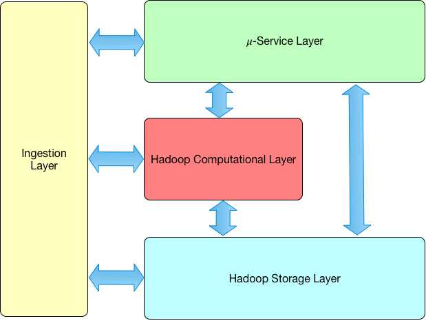

# Logical View

The DAF platform is ultimately an implementation of the “[data lake](https://en.wikipedia.org/wiki/Data_lake)” concept. Assembling a data lake involves a sequence of unavoidable steps meant to gather, organise and publish the data in an efficient and secure way.

The most important aspect to take into account in a data lake being set up is the data governance. Data governance means data organizations and metadata management. Being able to catalog the data sets together with their metadata is the prerequisite for implementing any further steps in the data lake set up such as data ingestion/egestion and data security.

The main abstraction the DAF platform is based upon is the [dataset](../dataset/). In a few words, a dataset means a collections of records described by some kind of schema. A dataset is identified by a *logical URI* and it is associated to a *physical URI* that identifies the actual medium and location where the data is actually stored.

A *LogicalURI* must be associated to one and only one *PhysicalURI* that can be associated to zero or more *ViewURIs*. Let’s explain this with an example. 

Let’s define a *LogicalURI*, for example:

`daf://open/milan/mobilita`

this can be bound to the following *PhysicalURI*

`dataset:hdfs://open/milan/mobilita` 

and eventually to a *ViewURI* like 

`dataset:hive://mobilita/milan` 

In other words, while a *PhysicalUri* represents the actual location on the Hadoop storage behind, a *ViewURI* represents the fact that a dataset can be also exposed/view through a different platform. 

As an example, a Hive/Impala external table created on top of a directory on HDFS represents a view of the same data stored in HDFS. This approach should allow modeling the mechanism of publishing datasets with low latency SQL engines like Impala/Presto.

All the metadata about datasets including their URIs are collected and organised in a catalog. This catalog is an essential component of the DAF platform: all the data ingestion steps and all the data manipulations’ steps that we allow on the data will be driven by it.

The high-level view of the architecture is pretty simple. It is based on the following layers:

* *𝜇-Service Layer*: it contains all the services needed to implement the platform functionalities. It also contains the catalog manager 𝜇-service (*CatalogManager*, described later in this page) which is responsible to manage all the [datasets metadata](../dataset-metadata).

* *Ingestion Layer*: it is responsible for all the ingestion tasks. It is be based on tools for data ingestion automation like [NiFi](https://nifi.apache.org/). It’s strongly integrated with the *CatalogManager* because, as already said, all the incoming data is listed in the catalog: This implies all the ingestion supporting tools is integrated with the *CatalogManager*.

* *Hadoop Computational Layer*: it contains all the typical computational platforms part of the extended Hadoop stack. The most important platform which is going to be used extensively by the platform is [Spark](http://spark.apache.org/). The 𝜇-service (in the 𝜇-service layer) uses the computational layer for tasks like data access and data manipulation/transformation.
   The ingestion layer uses the computational layer for implementing tasks like data conversion/transformation.

* *Hadoop Storage Layer*: it contains all the storage platform provided by Hadoop: HDFS, Kudu and HBase. As described above the physical URIs contain the information for accessing the data as stored on those storage platforms.

The following image summarizes the logical view of the DAF architecture: 

